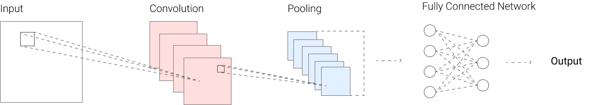

# Introduction

In this document I'm going to explain in short how CNN works and how I'm going to approach the problem. We're going to work on a decent size data set provided by Intel that contains natural images of 6 different categories. Our goal is to create a model that can distinguish between these classes, hopefully with >90% accuracy. Before diving into the project I want to shortly explain how a CNN works to people not familiar with the topic yet.

## What is a CNN?

**CNN (Convoluted Neural Network)** is a little bit different from out standard deep network, mainly in the way the data is processed before being trained on. Let's imagine a following scenario: we have a set of pictures to classify and we're creating a network for this purpose. We might want to use a CNN that helps us achieve a better accuracy by using filters before parsing the data into our dense layers. Why filters are important? After filtering an image, features that are important can then come to the forefront and we can use them to identify something. A filter is nothing else than a set of multipliers. I think by now everyone saw one in their life, we apply blurring filters in the image background to create depth or sharpen it before posting on Instagram. There is many useful filters we can use and you can read about them more in depth on [Keras documentation website.](https://keras.io/api/layers/)

## Graphical representation of the CNN

If you're a visual learner like me it might be useful to see some graphical representation of how a CNN works in practice. I will also show some examples of the data processing that happens before we use the dense layers in our model. 

In this very simple graph we can see how a very basic CNN is built. First we see the convolution layers and then pulling from which the data goes to our fully connected network. Let's shortly go trough how a convolution layer transforms the data. The convolution layer simply transforms a x by x batch of pixels into a single value.

### Illustration of the convolution layer

[_Image source._](https://eg.bucknell.edu/~cld028/courses/379-FA19/NN/convTF-Walk-Thru.html)

Above we can see how the convolution works in theory. Like said before it transforms many values to one value, and thanks to that important features get highlighted. It basically summarizes the presence of detected features. It's normal for a CNN to have many of these layers with different parameters that "teach" the network different ways of "looking" at the data.

 

[_Image source._](https://www.pyimagesearch.com/2016/07/25/convolutions-with-opencv-and-python/)

Here we can see how applying such layer looks in practice. As we can see thanks to applying a specified formula to the pixels the image changed highlighting the edges and revealing the information more clearly.

### Illustration of the pooling layer

We have a few different pooling options to work with, I will shortly showcase two of them, Max Pooling and Average Pooling. Pooling is just another building block in our network. It helps us with progressively reducing the spatial size of the image which results in reduced amount of parameters in the network as well as the computation time. Max pooling gets the maximum value from the feature batch and average one gets the average.

