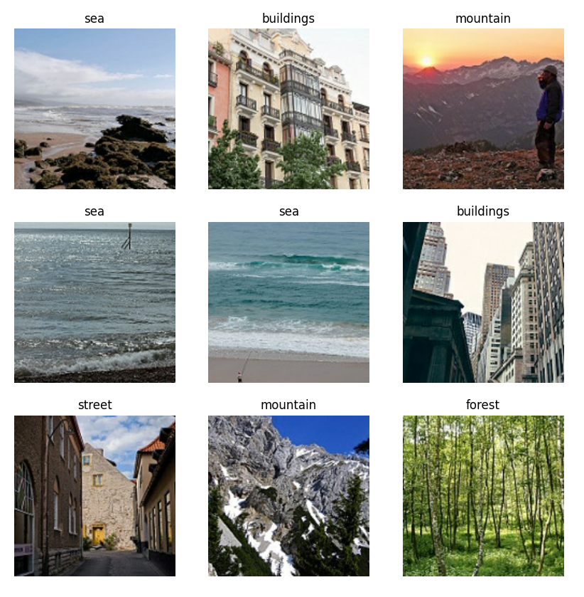
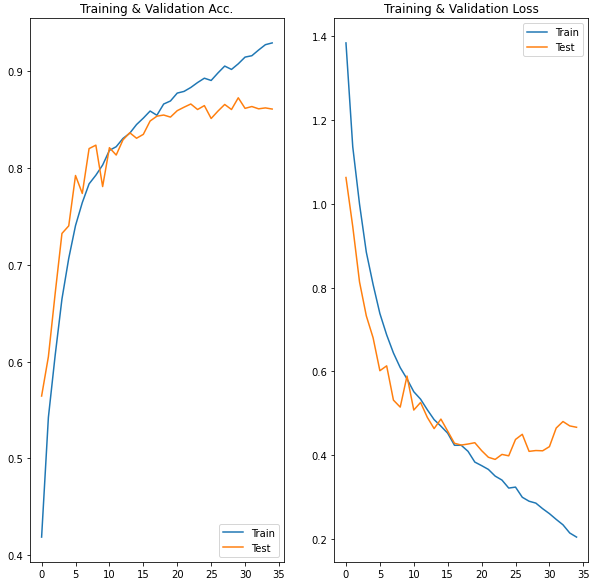

# Classifying the images

In this document I'm going to walk you trough my thought process and how I build the model. Let's start with introduction of the problem. I'm working with a small-medium batch of natural images that showcase things like mountains, beaches, cities etc. We are going to try predicting classes of the images by building a CNN. In my case, I'm going to use Keras but you can of course use any other similar library. I have a few goals in mind while going into this project:

- I want to see how big of a difference in accuracy using a tuner can make
- I want to see if using strides instead of pooling really gives a better result, and if not, in which cases it would


## Importing the libraries

Before making the model, we first have to load all needed libraries (there is a requirements.txt file in the repository that you can use) as well as our images. I will also standardize the data by dividing it by 255.

```python
from tensorflow.keras import layers
import tensorflow as tf
from tensorflow.keras import Sequential
from tensorflow.keras.preprocessing import image_dataset_from_directory as idfd
import matplotlib.pyplot as plot
```


_Note: I'm going to use vanilla python way of importing the images and save the datasets as numpy arrays because they are a little bit faster. Keep in mind that you can do the same wit an in-build Keras method._

```Python
# Load the images and their labels into a data set
def getImages(dataset_dir, img_size):
    dataset_array = []
    dataset_labels = []

    class_counter = 0

    class_names = os.listdir(dataset_dir)
    for current_class_name in class_names:
        # Get class directory
        class_dir = os.path.join(dataset_dir, current_class_name)

        # Keep track of the class that is being extracted
        images_in_class = os.listdir(class_dir)
        print("Class index", class_counter, ", ", current_class_name, ":", len(images_in_class))

        for image_file in images_in_class:
            if image_file.endswith(".jpg"):
                image_file_dir = os.path.join(class_dir, image_file)

                img = tf.keras.preprocessing.image.load_img(image_file_dir, target_size=(img_size, img_size))
                img_array = tf.keras.preprocessing.image.img_to_array(img)

                img_array = img_array / 255.0

                dataset_array.append(img_array)
                dataset_labels.append(class_counter)

        # Increase the counter when we're done with a class
        class_counter += 1

    # Shuffle both lists the same way
    dataset_array, dataset_labels = shuffle(dataset_array, dataset_labels, random_state=817328462)

    # Transform to a numpy array
    dataset_array = np.array(dataset_array)
    dataset_labels = np.array(dataset_labels)
    return dataset_array, dataset_labels, class_names
```

```Python
>> Classes:  ['buildings', 'forest', 'glacier', 'mountain', 'sea', 'street']
```


## Exploring the images

Lovely, we know our classes now but I would also like to see how the images look like. Perhaps that insight could help us with creating the model later, who knows? Let's give it a try. I won't include the plots code here since I think it's not necessary to our storytelling, the plots themselves will provide enough of it.





## Creating the base model

Now I'm going to create our basic model and evaluate its accuracy. Later I'm going to use this model with the Keras tuner to see if I can achieve more accuracy by tuning the hyperparameters as well as do some other tests with it. I'm going to use three conv2d layers, some pooling to reduce and then flatten the data. After that we only have our basic dense layers with a dropout. If you don't know what these layers are doing, let me explain it in short. I will also leave some links to resources by the end of this file.

- The **Conv2D layers** transform the input image into a very abstract representation, they basically take a group of x by x pixels and bring their values into one pixel with the average of all values
- The **MaxPooling2D layers** down samples the input representation, it takes the maximum value trough a window defined by pool_size
- The **Flatten layer** transforms our data into a one-dimensional one since the dense layer can accept it only in that form


```Python
# Creating the model
model = Sequential()
model.add(layers.Conv2D(200, kernel_size=(3, 3), activation='relu'))
model.add(layers.Conv2D(180, kernel_size=(3, 3), activation='relu'))
model.add(layers.MaxPool2D(5, 5))
model.add(layers.Conv2D(180, kernel_size=(3, 3), activation='relu'))
model.add(layers.Conv2D(140, kernel_size=(3, 3), activation='relu'))
model.add(layers.Conv2D(100, kernel_size=(3, 3), activation='relu'))
model.add(layers.Conv2D(60, kernel_size=(3, 3), activation='relu'))
model.add(layers.MaxPool2D(5, 5))
model.add(layers.Flatten())
model.add(layers.Dense(180, activation='relu'))
model.add(layers.Dense(100, activation='relu'))
model.add(layers.Dense(60, activation='relu'))
model.add(layers.Dropout(rate=0.5))
model.add(layers.Dense(6, activation='softmax'))

model.compile(optimizer=optimizer.Adam(learning_rate=0.0001), loss='sparse_categorical_crossentropy',
              metrics=['accuracy'])
```

Alright! We created our model so the next step will be the fun part - testing it. I created a few functions to visualise our accuracy measures so we can see it getting plotted nicely later. I also chose to build it with 35 epochs.


## Training the model

The only thing I have to say before going to actually train the model is that I'm going to use 30% of the data set for validation and then use the test data set to run predictions. Also, make sure that if you were to run the code, it's using the GPU because it makes the training time significantly faster. Below I copy-pasted the output of the training as well as the model summary. Both provide important insight into the model.

```Python
Epoch 1/35
307/307 [==============================] - 50s 147ms/step - loss: 1.5546 - accuracy: 0.3188 - val_loss: 1.0627 - val_accuracy: 0.5645
Epoch 2/35
307/307 [==============================] - 43s 139ms/step - loss: 1.1735 - accuracy: 0.5277 - val_loss: 0.9457 - val_accuracy: 0.6051
Epoch 3/35
307/307 [==============================] - 43s 139ms/step - loss: 1.0304 - accuracy: 0.5843 - val_loss: 0.8133 - val_accuracy: 0.6704
Epoch 4/35
307/307 [==============================] - 43s 139ms/step - loss: 0.8998 - accuracy: 0.6496 - val_loss: 0.7323 - val_accuracy: 0.7324
Epoch 5/35
307/307 [==============================] - 43s 139ms/step - loss: 0.8127 - accuracy: 0.7006 - val_loss: 0.6800 - val_accuracy: 0.7402
Epoch 6/35
307/307 [==============================] - 43s 139ms/step - loss: 0.7616 - accuracy: 0.7290 - val_loss: 0.6013 - val_accuracy: 0.7922
Epoch 7/35
307/307 [==============================] - 43s 139ms/step - loss: 0.6844 - accuracy: 0.7698 - val_loss: 0.6129 - val_accuracy: 0.7737
Epoch 8/35
307/307 [==============================] - 43s 139ms/step - loss: 0.6538 - accuracy: 0.7768 - val_loss: 0.5311 - val_accuracy: 0.8200
Epoch 9/35
307/307 [==============================] - 43s 139ms/step - loss: 0.6066 - accuracy: 0.7960 - val_loss: 0.5144 - val_accuracy: 0.8236
Epoch 10/35
307/307 [==============================] - 43s 139ms/step - loss: 0.5868 - accuracy: 0.8006 - val_loss: 0.5886 - val_accuracy: 0.7808
Epoch 11/35
307/307 [==============================] - 43s 139ms/step - loss: 0.5572 - accuracy: 0.8098 - val_loss: 0.5074 - val_accuracy: 0.8209
Epoch 12/35
307/307 [==============================] - 43s 139ms/step - loss: 0.5347 - accuracy: 0.8234 - val_loss: 0.5256 - val_accuracy: 0.8133
Epoch 13/35
307/307 [==============================] - 43s 139ms/step - loss: 0.5134 - accuracy: 0.8284 - val_loss: 0.4898 - val_accuracy: 0.8290
Epoch 14/35
307/307 [==============================] - 43s 139ms/step - loss: 0.4823 - accuracy: 0.8418 - val_loss: 0.4631 - val_accuracy: 0.8364
Epoch 15/35
307/307 [==============================] - 43s 139ms/step - loss: 0.4742 - accuracy: 0.8440 - val_loss: 0.4858 - val_accuracy: 0.8307
Epoch 16/35
307/307 [==============================] - 43s 139ms/step - loss: 0.4561 - accuracy: 0.8507 - val_loss: 0.4570 - val_accuracy: 0.8347
Epoch 17/35
307/307 [==============================] - 43s 139ms/step - loss: 0.4265 - accuracy: 0.8584 - val_loss: 0.4280 - val_accuracy: 0.8485
Epoch 18/35
307/307 [==============================] - 43s 139ms/step - loss: 0.4154 - accuracy: 0.8573 - val_loss: 0.4238 - val_accuracy: 0.8535
Epoch 19/35
307/307 [==============================] - 43s 139ms/step - loss: 0.4081 - accuracy: 0.8650 - val_loss: 0.4263 - val_accuracy: 0.8547
Epoch 20/35
307/307 [==============================] - 43s 139ms/step - loss: 0.3835 - accuracy: 0.8677 - val_loss: 0.4294 - val_accuracy: 0.8525
Epoch 21/35
307/307 [==============================] - 43s 139ms/step - loss: 0.3800 - accuracy: 0.8778 - val_loss: 0.4106 - val_accuracy: 0.8592
Epoch 22/35
307/307 [==============================] - 43s 139ms/step - loss: 0.3669 - accuracy: 0.8803 - val_loss: 0.3946 - val_accuracy: 0.8627
Epoch 23/35
307/307 [==============================] - 42s 138ms/step - loss: 0.3474 - accuracy: 0.8835 - val_loss: 0.3895 - val_accuracy: 0.8661
Epoch 24/35
307/307 [==============================] - 43s 139ms/step - loss: 0.3435 - accuracy: 0.8869 - val_loss: 0.4014 - val_accuracy: 0.8604
Epoch 25/35
307/307 [==============================] - 43s 139ms/step - loss: 0.3231 - accuracy: 0.8951 - val_loss: 0.3981 - val_accuracy: 0.8644
Epoch 26/35
307/307 [==============================] - 43s 139ms/step - loss: 0.3055 - accuracy: 0.8962 - val_loss: 0.4372 - val_accuracy: 0.8511
Epoch 27/35
307/307 [==============================] - 43s 139ms/step - loss: 0.2865 - accuracy: 0.8998 - val_loss: 0.4495 - val_accuracy: 0.8587
Epoch 28/35
307/307 [==============================] - 43s 139ms/step - loss: 0.2835 - accuracy: 0.9080 - val_loss: 0.4087 - val_accuracy: 0.8656
Epoch 29/35
307/307 [==============================] - 43s 139ms/step - loss: 0.2754 - accuracy: 0.9055 - val_loss: 0.4107 - val_accuracy: 0.8604
Epoch 30/35
307/307 [==============================] - 43s 139ms/step - loss: 0.2716 - accuracy: 0.9087 - val_loss: 0.4101 - val_accuracy: 0.8725
Epoch 31/35
307/307 [==============================] - 43s 139ms/step - loss: 0.2665 - accuracy: 0.9110 - val_loss: 0.4200 - val_accuracy: 0.8616
Epoch 32/35
307/307 [==============================] - 43s 139ms/step - loss: 0.2512 - accuracy: 0.9160 - val_loss: 0.4644 - val_accuracy: 0.8635
Epoch 33/35
307/307 [==============================] - 43s 139ms/step - loss: 0.2364 - accuracy: 0.9217 - val_loss: 0.4800 - val_accuracy: 0.8611
Epoch 34/35
307/307 [==============================] - 43s 139ms/step - loss: 0.2073 - accuracy: 0.9287 - val_loss: 0.4695 - val_accuracy: 0.8620
Epoch 35/35
307/307 [==============================] - 43s 139ms/step - loss: 0.1987 - accuracy: 0.9350 - val_loss: 0.4663 - val_accuracy: 0.8608
```

```Python
Layer (type)                 Output Shape              Param #   
=================================================================
conv2d (Conv2D)              (None, 148, 148, 200)     5600      
_________________________________________________________________
conv2d_1 (Conv2D)            (None, 146, 146, 180)     324180    
_________________________________________________________________
max_pooling2d (MaxPooling2D) (None, 29, 29, 180)       0         
_________________________________________________________________
conv2d_2 (Conv2D)            (None, 27, 27, 180)       291780    
_________________________________________________________________
conv2d_3 (Conv2D)            (None, 25, 25, 140)       226940    
_________________________________________________________________
conv2d_4 (Conv2D)            (None, 23, 23, 100)       126100    
_________________________________________________________________
conv2d_5 (Conv2D)            (None, 21, 21, 50)        45050     
_________________________________________________________________
max_pooling2d_1 (MaxPooling2 (None, 4, 4, 50)          0         
_________________________________________________________________
flatten (Flatten)            (None, 800)               0         
_________________________________________________________________
dense (Dense)                (None, 180)               144180    
_________________________________________________________________
dense_1 (Dense)              (None, 100)               18100     
_________________________________________________________________
dense_2 (Dense)              (None, 50)                5050      
_________________________________________________________________
dropout (Dropout)            (None, 50)                0         
_________________________________________________________________
dense_3 (Dense)              (None, 6)                 306       
=================================================================
Total params: 1,187,286
Trainable params: 1,187,286
Non-trainable params: 0
```


## Evaluation




